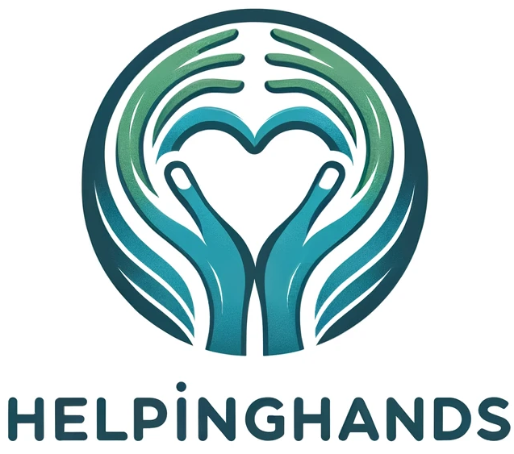

  
      
   

# HelpingHands - SE Project by team Nomads

Welcome to the official repository of HelpingHands, a platform dedicated to facilitating non-monetary donations across a variety of categories including clothes, toys, medical supplies, and more. Our mission is to create a bridge between donors and recipients, making it easier for everyone to contribute to meaningful causes.

## Getting Started

These instructions will get you a copy of the project up and running on your local machine for development and testing purposes.
- Install dependencies:
  > npm install
- Start the development server:
  > npm run dev
